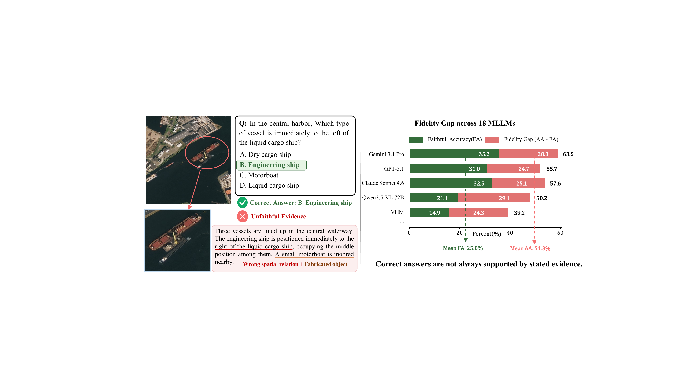
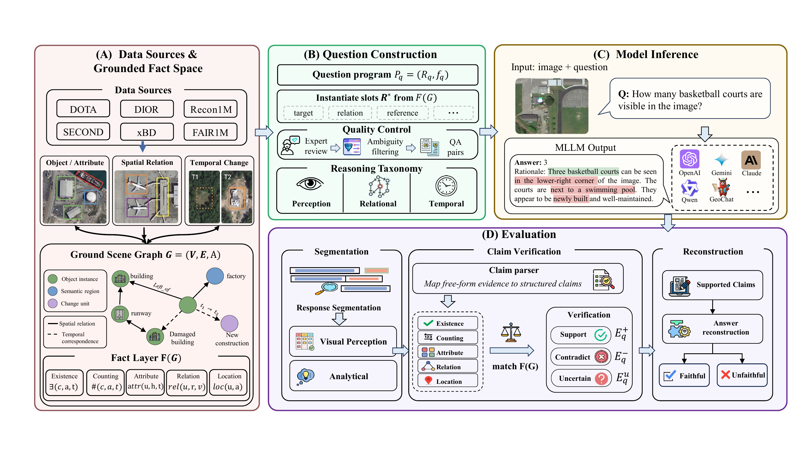
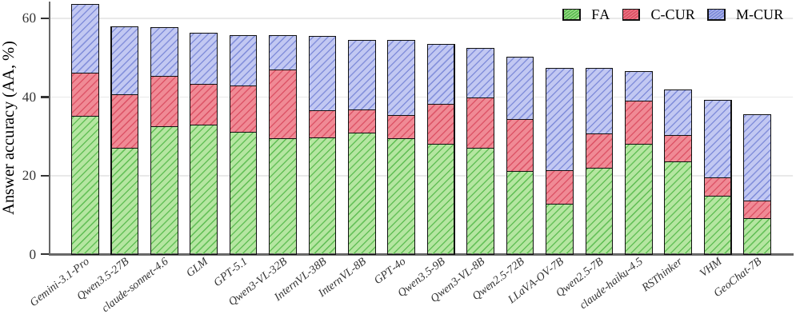
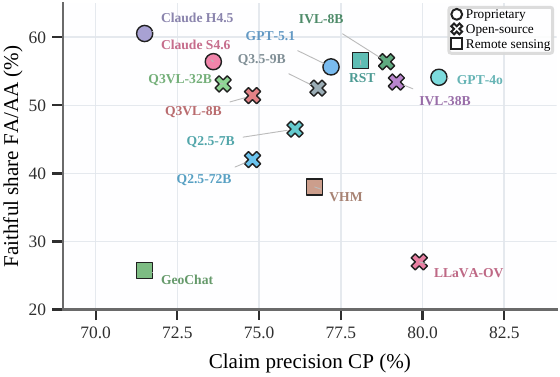
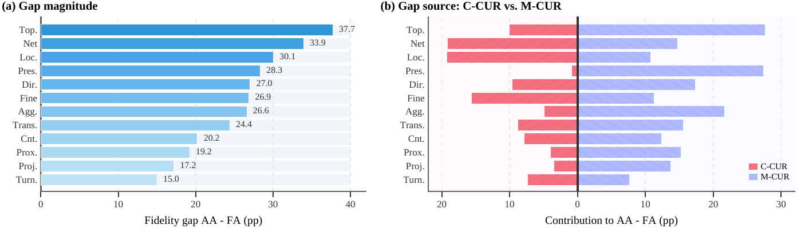
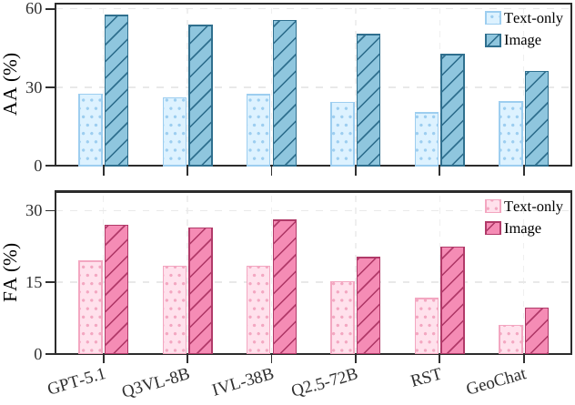

# RSFaith-Bench

Code for **RSFaith-Bench: Evaluating Answer-Evidence Faithfulness in Remote
Sensing MLLMs**.

RSFaith-Bench evaluates remote-sensing VQA models at two levels: whether the
final answer is correct, and whether the model's stated visual evidence
faithfully supports that answer. Each example pairs a question with answer
choices, image path(s), a compact scene graph, gold evidence claims, and an
executable question program used by the evaluator.

The paper reports 13,511 questions, 16,288 images, and 12 task categories across
Perception, Relational Reasoning, and Temporal Reasoning. This repository
contains the evaluation harness, metric code, schema documentation, a
no-network smoke test, selected paper figures, and a 600-example released subset
with 50 examples per subcategory. Full benchmark data, model outputs, claim
extraction logs, and figure source data are not included.

## Figures

**Teaser**



**Benchmark And Evaluation Overview**



**Answer-Evidence Decomposition**



**Model Evidence Diagnostics**



**Subtype Diagnostics**



**Visual Control Analysis**



## Repository Layout

- `src/rsfaith_bench/`: dataset loading, answer parsing, claim extraction
  helpers, verifier, executable programs, metrics, and reporting.
- `src/scripts/`: command-line scripts for inference, claim extraction,
  evaluation, summarization, and data validation.
- `configs/`: public benchmark taxonomy and label ontology.
- `RSFaith-Bench_subset/`: 600-example released subset with images, scene
  graphs, questions, support claims, and programs.
- `docs/dataset_schema.md`: released dataset and program schema.
- `docs/prediction_format.md`: prediction, claim, and evaluation-output formats.
- `docs/evaluation_protocol.md`: operational definition of AA, CP, FA, C-CUR,
  and M-CUR.
- `docs/reproduction.md`: end-to-end reproduction commands.
- `assets/`: selected final paper figures.
- `scripts/smoke_test.sh`: runtime-generated no-network fixture for checking the
  evaluation pipeline.
- `tests/test_smoke.py`: lightweight pipeline smoke tests.

## Quick Check

```bash
bash scripts/smoke_test.sh
```

The smoke test validates the released subset, creates a no-network fixture from
released support claims, runs evaluation, writes metric summaries under
`outputs/smoke/`, and runs the lightweight unit tests.

## Released Subset Usage

```bash
pip install -r requirements.txt
export PYTHONPATH=$PWD/src

python src/scripts/validate_data.py \
  --data RSFaith-Bench_subset \
  --expect-per-category 50
```

Prepare model predictions as JSONL:

```json
{"question_id": "RSF-Q00000001", "model_name": "my-model", "response": "Evidence: ...\nAnswer: C"}
```

Extract claims from model reasoning with an OpenAI-compatible text model, then
run evaluation:

```bash
python src/scripts/extract_claims.py \
  --data RSFaith-Bench_subset \
  --responses predictions.jsonl \
  --model "$OPENAI_MODEL" \
  --base-url "$OPENAI_BASE_URL" \
  --api-key "$OPENAI_API_KEY" \
  --output outputs/claims.jsonl

python src/scripts/evaluate.py \
  --data RSFaith-Bench_subset \
  --pred predictions.jsonl \
  --claims outputs/claims.jsonl \
  --output outputs/eval_faithfulness.jsonl
```

Summarize item-level results:

```bash
python src/scripts/summarize.py --eval outputs/eval_faithfulness.jsonl --group overall --output outputs/summary_overall.csv
python src/scripts/summarize.py --eval outputs/eval_faithfulness.jsonl --group level --output outputs/summary_level.csv
python src/scripts/summarize.py --eval outputs/eval_faithfulness.jsonl --group subcategory --output outputs/summary_subcategory.csv
```

## OpenAI-Compatible Inference

```bash
python src/scripts/infer_api.py \
  --data RSFaith-Bench_subset \
  --model "$OPENAI_MODEL" \
  --base-url "$OPENAI_BASE_URL" \
  --api-key "$OPENAI_API_KEY" \
  --output outputs/responses.jsonl
```

The inference script uses the evidence-first response prompt described in the
paper and in `docs/reproduction.md`.

## Metrics

The evaluator reports:

- `aa`: answer accuracy.
- `cp`: claim precision over questions with at least one supported or
  contradicted claim.
- `fa`: correct answer with supported answer-critical evidence and no
  contradicted claim.
- `C-CUR`: correct answer with at least one contradicted visual claim.
- `M-CUR`: correct answer with missing required visual evidence and no
  contradicted claim.

For faithfulness evaluation, each correct answer falls into exactly one of
`fa`, `C-CUR`, or `M-CUR`.

## Citation

Please cite the paper when using RSFaith-Bench.
